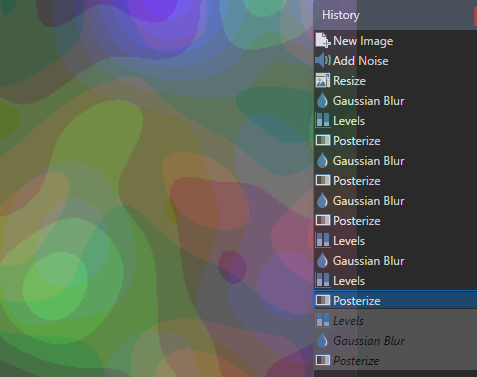
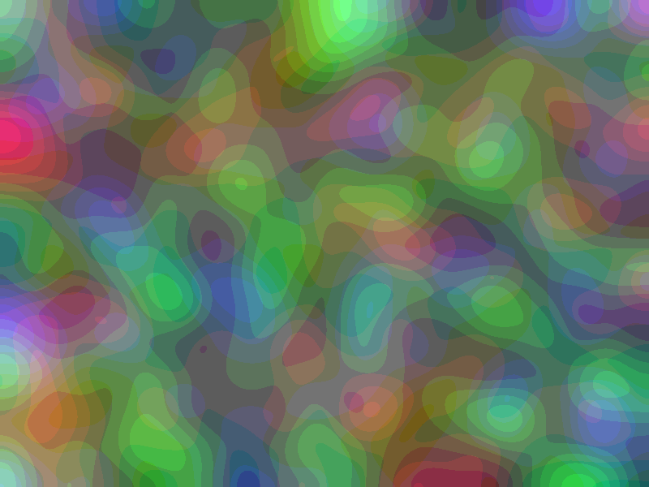
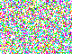
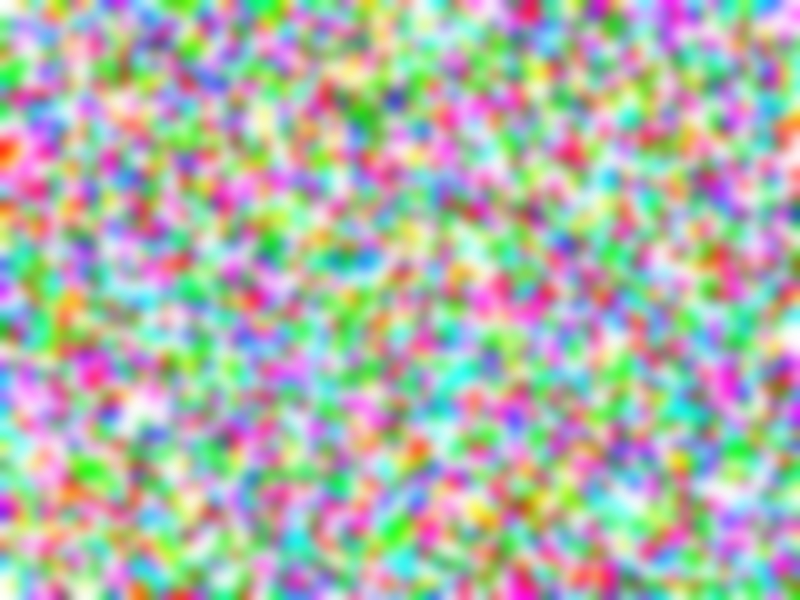
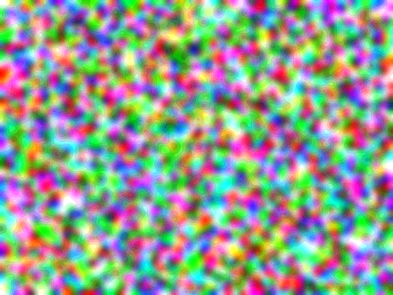

# Efficient Terrain Generator for Apple II

Terrain generating produces a random natural landscape for gaming, demos, organic artifacts of sky clouds, plasma clouds, even non-visual data. Arranged in a two-dimensional array for X and Y and values for height, the resulting 3D mesh will be treated here as a flat contour with colors for heights. Such terrain has area resolution (width and height in pixels) and the height range (possible colors).

There are a number of methods for terrain generation: "1D Hill" adding random sine curves, or progressively adding random numbers in mid-points, producing brownian-looking curves; "Cellular Automata Cave" a piano roll of 1D Game of Life, making organic but only 2-color contours; "Voronoi Noise" is interesting but too complex; "Diamong Square" breaks down a grid adding random noise and averaging and produces nebulous features; "Perlin Noise" using gradients and interpolation produces highly realistic fine detail at the expense of complexity; and its marginally improved "Simplex Noise" variation. Most of these algorithms would be too slow for Apple II or in simpler cases would not produce a nice organic terrain.

So we use **Mean Smoothing with Mismatched Kernel** -- an original approach, which has simple calculations, yet  producing surprisingly believable terrains for its complexity. In each of 10 iterations the 2D array is processed separately in each dimension: line-by-line then column-by-column -- to extend radially. The Mean kernel convolution replaces each pixel with an average of its neighbors. To utilize 8-bit shifting for division, we choose kernel width four -- an even number. So the starting pixel should match the evenness of the iteration to avoid drifting -- a small trade-off. The starting image contains random numbers in square blocks of five, thus mismatching the the kernel size to prevent grid aftifacts and banding. Further aiding this goal, over 10 iterations of 2.5-pixel radius each pixel has butterfly effect extending 25 pixels in each radial direction.

The DoLoRes mode provides 40x48 near-square resolution and 16 colors. The data and calculations are represented in bytes -- with 256 possible values. Since only 4 bits out of 8 are needed for 16 colors, to render the final surface we use the high 4 bits, thus applying a low-pass filter on our image. The low 4 bits are the finer granularity. This feature is also useful in a couple of ways: cycling over the bits by rotating the byte we can produce an interesting palette-shifting effect with a band-pass filter; narrowing the band can posterize the image producing walls and caves; by replacing the low bits with random noise in each iteration, we can nebulize the result.

## Illustration of the algorithm using Posterizing

The **Blur** step represents the Mean smoothing. The **Posterize** step represents division and dropping of the low bits.

| Blur and Posterize steps  | Resulting Image |
| - | - |
|   |   |
| Seed Image of random values | Expanding blocks |
|  |  |
| Generation 1 - Blur step | Generation 1 - Posterize step |
|  |  |
| Generation 2 | Generation 3 |
|  |  |
